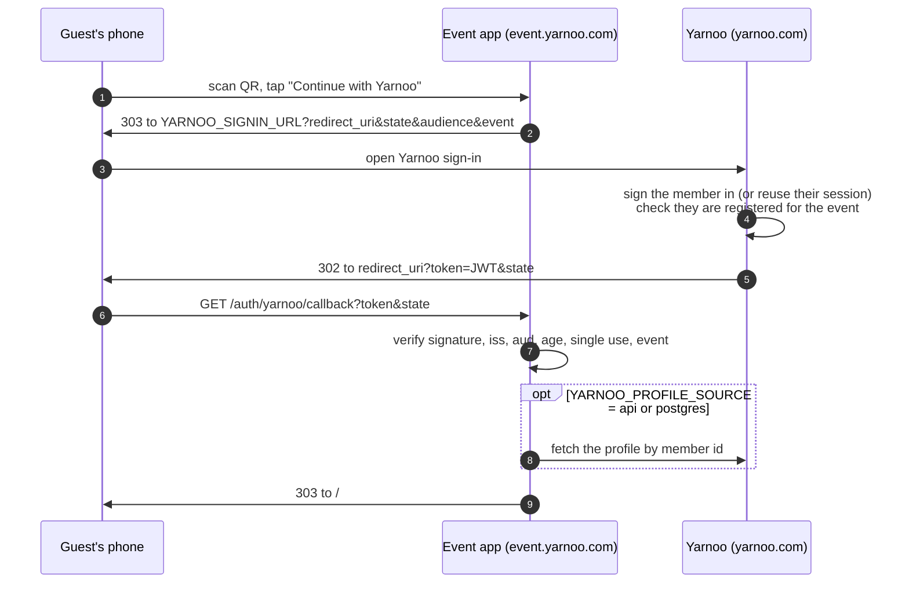

# Sign in with Yarnoo — integration guide

For the Yarnoo engineering team. This is everything needed to put Spin The Wheel
on a Yarnoo domain and seat guests as their **Yarnoo profiles** instead of
anonymous names typed at the door.

The event app is already built for it. Yarnoo builds **one endpoint** — a sign-in
handoff that signs a short-lived token for the logged-in member — and sets a few
environment variables. Everything else on this page is reference.

---

## How it works



- **The event app never sees a Yarnoo password**, and does not need Yarnoo's
  database to let someone in: Yarnoo vouches for the member with a signed token.
- **One profile is one seat.** Signing in again (second phone, cleared browser)
  returns the same seat and history — the matcher never sees the same person twice.
- **Members see each other's profiles.** Group lists show each person's Yarnoo
  photo and a link to their profile; when the event ends, every guest gets a list
  of everyone they met, linked to Yarnoo. The operator's CSV export includes the
  Yarnoo id and profile URL of every guest.

---

## What Yarnoo builds

### 1. The sign-in handoff endpoint

Any URL on Yarnoo's side — for example `https://yarnoo.com/connect/spin-the-wheel`.
Set it as `YARNOO_SIGNIN_URL`. The event app sends the phone there with:

| Query parameter | Meaning |
|---|---|
| `redirect_uri` | Where to send the member back: `https://<event domain>/auth/yarnoo/callback` |
| `state` | Opaque value. **Return it unchanged.** |
| `audience` | `spin-the-wheel` (or `YARNOO_JWT_AUDIENCE`) — put it in the token's `aud` |
| `event` | Present when `YARNOO_EVENT_ID` is set — the event the member must be registered for |

The endpoint must:

1. **Check `redirect_uri` against an allow-list — exact string match** with the
   callback URL of your deployment(s). Never redirect a token anywhere else.
2. Sign the member in, or reuse their existing Yarnoo session.
3. If `event` is given, check the member is registered for it. If not, redirect
   back with `?error=not_registered&state=…` instead of a token.
4. Sign a token (below) and redirect to `redirect_uri?token=<JWT>&state=<state>`.
5. If the member cancels, redirect with `?error=access_denied&state=…`.

The Yarnoo app can also link straight to
`https://<event domain>/auth/yarnoo/callback?token=…` for a member who is already
signed in — no `state` is needed for that. What protects those links is that
every token is accepted **once**: mint a fresh one per link.

### 2. The token

A JWT. Keep it short-lived; the app refuses anything older than 10 minutes.

| Claim | Required | Example | Used for |
|---|---|---|---|
| `sub` | **yes** | `"48213"` | The Yarnoo member id — the guest's identity |
| `iss` | **yes** | `"https://yarnoo.com"` | Must equal `YARNOO_JWT_ISSUER` |
| `aud` | **yes** | `"spin-the-wheel"` | Must equal `YARNOO_JWT_AUDIENCE` |
| `iat`, `exp` | **yes** | now, now + 300 | Age and expiry |
| `jti` | **yes** | random UUID | A unique id — each token is accepted once |
| `name` | recommended | `"Layla Haddad"` | Shown to the group (60 chars) |
| `picture` | optional | `https://cdn.yarnoo.com/u/48213.jpg` | Photo in group lists (https only) |
| `role` | optional | `"Singer"` | Under the name (also read from `headline`, `category`, `title`) |
| `company` | optional | `"Stage Nine"` | Seats colleagues apart (also `organization`, `agency`) |
| `profile_url` | optional | `https://yarnoo.com/u/layla` | Profile link (https only) |
| `event` / `events` | when `YARNOO_EVENT_ID` is set | `"community-night"` | Proves registration for this event |

Any profile claim can be left out of the token and fetched instead — see
[Profiles](#profiles).

#### Signing — HS256 with a shared secret (simplest)

Generate a secret of at least 32 characters (`openssl rand -hex 32`), give it to
both sides, and set it as `YARNOO_JWT_SECRET` on the event app.

**Node.js** (`jose`):

```js
import { SignJWT } from 'jose';

const token = await new SignJWT({
  name: user.displayName,
  picture: user.avatarUrl,
  role: user.headline,
  company: user.company,
  profile_url: `https://yarnoo.com/u/${user.username}`,
  event: req.query.event                       // only after checking registration
})
  .setProtectedHeader({ alg: 'HS256' })
  .setSubject(String(user.id))
  .setIssuer('https://yarnoo.com')
  .setAudience('spin-the-wheel')
  .setIssuedAt()
  .setExpirationTime('5m')
  .setJti(crypto.randomUUID())
  .sign(new TextEncoder().encode(process.env.SPIN_THE_WHEEL_SECRET));

res.redirect(`${allowedRedirectUri}?${new URLSearchParams({ token, state: req.query.state })}`);
```

**PHP** (`firebase/php-jwt`):

```php
use Firebase\JWT\JWT;

$now = time();
$token = JWT::encode([
    'iss' => 'https://yarnoo.com',
    'aud' => 'spin-the-wheel',
    'sub' => (string) $user->id,
    'iat' => $now,
    'exp' => $now + 300,
    'jti' => bin2hex(random_bytes(16)),
    'name' => $user->name,
    'picture' => $user->avatar_url,
    'role' => $user->headline,
    'company' => $user->company,
    'profile_url' => "https://yarnoo.com/u/{$user->username}",
    'event' => $request->query('event'),     // only after checking registration
], getenv('SPIN_THE_WHEEL_SECRET'), 'HS256');

return redirect($allowedRedirectUri . '?' . http_build_query(['token' => $token, 'state' => $request->query('state')]));
```

**Python** (`PyJWT`):

```python
import jwt, time, uuid

now = int(time.time())
token = jwt.encode({
    "iss": "https://yarnoo.com", "aud": "spin-the-wheel", "sub": str(user.id),
    "iat": now, "exp": now + 300, "jti": uuid.uuid4().hex,
    "name": user.name, "picture": user.avatar_url, "role": user.headline,
    "company": user.company, "profile_url": f"https://yarnoo.com/u/{user.username}",
    "event": request.args.get("event"),
}, SPIN_THE_WHEEL_SECRET, algorithm="HS256")
```

#### Signing — RS256 / ES256 with published keys (no shared secret)

If Yarnoo already signs JWTs with a private key (or runs an OIDC provider), keep
the private key on Yarnoo's side and publish the public keys as a JWKS. Set
`YARNOO_JWKS_URL` (e.g. `https://yarnoo.com/.well-known/jwks.json`) instead of
`YARNOO_JWT_SECRET`. Accepted algorithms: RS256, PS256, ES256, EdDSA. Keys are
fetched and cached by `kid`, so rotation needs no change on the event side.

### 3. Profiles

Set `YARNOO_PROFILE_SOURCE`:

| Value | Where the profile comes from |
|---|---|
| `claims` (default) | The token itself — nothing else to build |
| `api` | `GET YARNOO_PROFILE_URL` with `{id}` replaced by the member id, header `Authorization: Bearer YARNOO_API_KEY`. JSON body, or `{ "data": { … } }` |
| `postgres` | `YARNOO_PROFILE_SQL` run against `YARNOO_DATABASE_URL` with the member id as `$1` |

Whichever source, these field names are understood (first one present wins):

| Field | Accepted names |
|---|---|
| id | `sub`, `id`, `user_id`, `yarnoo_id` |
| name | `name`, `display_name`, `full_name`, or `given_name`/`first_name` + `family_name`/`last_name` |
| role | `role`, `headline`, `category`, `title` |
| company | `company`, `organization`, `agency` |
| photo | `picture`, `avatar_url`, `avatar`, `photo_url` |
| profile link | `profile_url`, `profile`, `url` |

Example for `postgres` — use a **read-only role** that can see only this view:

```sql
create view spin_the_wheel_profiles as
  select u.id, u.display_name, u.headline, u.agency, u.avatar_url,
         'https://yarnoo.com/u/' || u.username as profile_url
  from users u;

create role spin_the_wheel login password '…';
grant select on spin_the_wheel_profiles to spin_the_wheel;
```

```
YARNOO_PROFILE_SQL=select * from spin_the_wheel_profiles where id = $1
```

TLS to that database verifies the server certificate by default
(`YARNOO_DATABASE_SSL=verify`). A managed database with its own CA (RDS, Azure,
…) needs `YARNOO_DATABASE_CA` set to the CA bundle (PEM; `
` escapes are
fine). `no-verify` skips the check and `disable` turns TLS off — for a private
network only. An `sslmode` or `sslrootcert` inside `YARNOO_DATABASE_URL`
overrides all of this.

The id is always a bound parameter. If the profile lookup fails or is slow (4s
API timeout, 3s query timeout), the guest is still seated with what the token
said — a missing photo is better than a queue at the door. MySQL is not built in;
it is one function in `src/yarnoo.js` (`fromPostgres`) to mirror with `mysql2`.

---

## Putting it on a Yarnoo domain

The app is one Node service plus Postgres. On Railway:

1. New project from this repo. Add a **Postgres** service — `DATABASE_URL` is
   injected. Keep **one replica** (`railway.json` pins it): the live event is held
   in memory and snapshotted to Postgres; two replicas would hand out conflicting
   colours.
2. Set variables on the app service:

   | Variable | Value |
   |---|---|
   | `NODE_ENV` | `production` |
   | `ADMIN_PIN` | the operator console PIN |
   | `PUBLIC_URL` | `https://event.yarnoo.com` (your domain — the QR encodes it) |
   | `YARNOO_SIGNIN_URL` | your handoff endpoint |
   | `YARNOO_JWT_SECRET` *or* `YARNOO_JWKS_URL` | the key |
   | `YARNOO_JWT_ISSUER` | the `iss` you sign with |
   | `YARNOO_EVENT_ID` | optional — registered members only |
   | `YARNOO_PROFILE_SOURCE` (+ its settings) | optional |

   With a sign-in URL and a key set, the app defaults to **members only**. Set
   `YARNOO_AUTH=optional` to also allow walk-ins without an account.
3. **Custom domain needs two DNS records.** Add the domain in Railway, then create
   both records it shows: the `CNAME` (routes traffic) **and** the
   `TXT _railway-verify.<subdomain>` (proves ownership). With only the CNAME the
   domain never verifies, no certificate is issued, and Railway answers with its
   own 404 — which looks like a routing bug and is not one. The TXT value is only
   shown in the Railway dashboard. If a certificate stalls, do not delete and
   re-add the domain (Let's Encrypt rate-limits duplicates, and a re-add can change
   the CNAME target); `scripts/watch-domain.sh <domain> <cname target>` polls
   until HTTPS is live.
4. Add `https://event.yarnoo.com/auth/yarnoo/callback` to the handoff endpoint's
   redirect allow-list.
5. Check `https://event.yarnoo.com/health` — it reports the store (`postgres`)
   and the sign-in mode (`required`).

The server refuses to boot with a half-configured sign-in (for example
`YARNOO_AUTH=required` with no key, a secret under 32 characters, or
`YARNOO_DEV_SIGNIN` left on next to a real key), so a bad deploy fails its health
check instead of locking guests out — or letting anyone in.

---

## Testing before Yarnoo's side exists

- **Locally, end to end:** `YARNOO_DEV_SIGNIN=1 npm start`, open
  `http://localhost:3000` and tap *Continue with Yarnoo*. A stand-in sign-in page
  lets you pick a member; it signs a token exactly as Yarnoo will, with a
  throwaway secret of its own. It is never mounted when `NODE_ENV=production`, and
  the server refuses to start if it is combined with a real Yarnoo setting.
- **Against a deployment:** with the deployment's secret,
  ```
  YARNOO_JWT_SECRET=… YARNOO_JWT_ISSUER=https://yarnoo.com \
    node scripts/yarnoo-token.js --base https://event.yarnoo.com \
      --sub 48213 --name "Layla Haddad" --role Singer --company "Stage Nine"
  ```
  prints a callback URL — open it on a phone and you are seated as that member.
- **The checks:** `npm run e2e:yarnoo` boots its own servers and verifies the
  handoff, including the failure cases below.

## What the app checks, and what each refusal means

The guest lands back on the join screen with a plain-language message.

| Code | Cause |
|---|---|
| `invalid_token` | Bad signature, wrong `iss`/`aud`, disallowed algorithm (including `alg: none`), or no `sub` or `jti` |
| `expired` | `exp` passed, or `iat` more than 10 minutes ago |
| `already_used` | The `jti` was already accepted once |
| `not_registered` | `YARNOO_EVENT_ID` is set and the token's `event`/`events` does not include it |
| `state_mismatch` | The returned `state` is not the one this phone was given |
| `event_ended` | A new member signed in after the event ended (existing guests can still sign back in to see who they met) |
| `missing_token`, `access_denied`, … | No token, or an `error` sent back by Yarnoo |

Also, by design:

- Algorithms are pinned to the key type, so a token cannot choose its own.
- Every token is single use (`jti` is required), so a callback URL left in a
  shared phone's history or a proxy log cannot be replayed. Used ids are kept in
  memory for the 11 minutes a token could still be accepted.
- Photo and profile links must be `https://`; anything else (`javascript:`,
  `data:`) is dropped before it reaches a phone. Everything shown on a phone is
  rendered as text, never as HTML.
- The session token is handed to the phone in the URL **fragment**, which never
  reaches a server log or a `Referer`, and the page wipes it from the address bar.
  Sign-in responses are `Cache-Control: no-store` and `Referrer-Policy: no-referrer`.
- What the event app stores per guest: Yarnoo id, name, role, company, photo URL,
  profile URL, and who they were grouped with. It lives in the app's own Postgres
  and is cleared by *Reset everything* in the console.

## Where the code is

| File | What |
|---|---|
| `src/yarnoo.js` | Configuration, token verification, profile sources |
| `src/server.js` | `/auth/yarnoo/start`, `/auth/yarnoo/callback`, `/api/config` |
| `src/state.js` | `joinYarnoo()` — one profile, one seat |
| `src/devSignin.js` | The local stand-in sign-in page |
| `public/app.js` | The sign-in door, profile rows, the wrap-up list |
| `scripts/yarnoo-token.js` | Mint a test token |
| `scripts/e2e-yarnoo.js` | The end-to-end checks |
